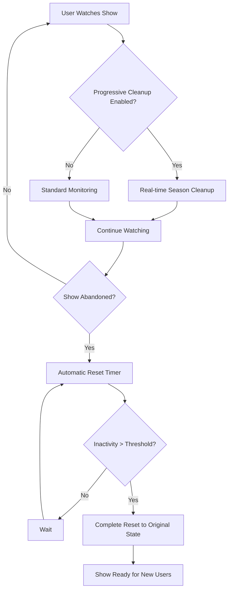

import useBaseUrl from '@docusaurus/useBaseUrl';

# Plex Session Monitoring

Pulsarr's Session Monitoring feature intelligently tracks active Plex viewing sessions and automatically triggers Sonarr searches for upcoming content based on user viewing patterns. This ensures that the next episodes or seasons are ready before users finish watching their current content.

## Key Features

- **Real-Time Session Monitoring**: Tracks active Plex viewing sessions as they happen
- **Smart Episode Detection**: Automatically identifies when users are near the end of seasons
- **Rolling Monitoring Support**: Progressive season downloads that expand based on viewing patterns
- **User Filtering**: Optionally restrict monitoring to specific Plex users
- **Deduplication**: Prevents duplicate searches with intelligent 7-day caching
- **Pilot Episode Handling**: Special logic for standalone pilot episodes
- **Cross-Instance Support**: Works across all your Sonarr instances simultaneously

## How It Works

Session Monitoring operates on a simple principle: **anticipate what users will want to watch next**.

### Standard Monitoring

When a user is watching a TV episode, the system:

1. **Detects the viewing session** via Plex's active sessions API
2. **Calculates remaining episodes** in the current season using Sonarr data
3. **Triggers searches** when users approach the end of a season (configurable threshold)
4. **Handles next seasons** by either searching existing seasons or enabling monitoring for new content

### Rolling Monitoring

For shows configured with rolling monitoring options:

1. **Starts minimal** - Only monitors pilot episode or first season initially
2. **Tracks viewing progress** - Records what users have watched
3. **Expands intelligently** - Adds next season monitoring when users near completion
4. **Switches to full monitoring** - Eventually transitions to monitoring all future content

## Rolling Monitoring Options

Rolling monitoring provides two progressive strategies for new content:

### Pilot Rolling
- **Initial State**: Only the pilot episode is monitored
- **Expansion**: When users watch the pilot, Season 1 remainder is searched
- **Progressive**: Additional seasons added as users progress
- **Best For**: New shows where you want to test user interest

### First Season Rolling  
- **Initial State**: All of Season 1 is monitored
- **Expansion**: Season 2 monitoring added when users near Season 1 completion
- **Progressive**: Subsequent seasons added based on viewing
- **Best For**: Established shows where Season 1 commitment is acceptable

## Configuration

### Basic Settings

Navigate to **Utilities > Plex Session Monitoring** to configure:

#### Enable/Disable Control
- **Session Monitoring Status**: Enable or disable the entire feature
  - Default: Disabled
  - When enabled, activates all monitoring features
  - When disabled, no sessions are processed

#### Monitoring Configuration
- **Polling Interval**: How often to check for active sessions (1-1440 minutes)
  - Default: 15 minutes
  - Lower values = more responsive monitoring
  - Higher values = reduced server load
  - Recommended: 15-30 minutes

- **Remaining Episodes Threshold**: When to trigger searches (1-10 episodes)
  - Default: 2 episodes
  - Example: With threshold 2, searches trigger when watching episode 8 of a 10-episode season
  - Recommended: 2-3 episodes

#### Filtering Options
- **Filter Users**: Optionally restrict monitoring to specific Plex users
  - Leave empty to monitor all users
  - Add specific users to focus monitoring efforts
  - Useful for households with different viewing preferences

### Rolling Monitoring Reset Settings

#### Automatic Reset
- **Enable Automatic Reset**: Automatically reset inactive rolling monitored shows
  - Default: Enabled
  - Reverts shows to original monitoring state (pilot-only or first-season-only)
  - Deletes excess episode files to save storage space
  - Helps manage storage for shows that users have abandoned

#### Progressive Cleanup
- **Enable Progressive Cleanup**: Automatically clean up previous seasons as users progress
  - Default: Disabled
  - Immediately removes previous seasons when users advance to new seasons
  - Only cleans up if no filtered users have watched within the inactivity period
  - Always preserves the original monitoring state (pilot-only or first-season-only)
  - Provides proactive storage management while respecting user access patterns

#### Reset Configuration
- **Inactivity Reset Days**: Days without watching before resetting (1-365 days)
  - Default: 7 days
  - Shows not watched within this period are considered inactive
  - Shorter periods = more aggressive storage management
  - Longer periods = more lenient for sporadic viewing

- **Auto Reset Check Interval**: How often to check for inactive shows (1-168 hours)
  - Default: 24 hours
  - Controls how frequently the system checks for inactive shows
  - Lower values = more frequent cleanup checks
  - Higher values = less server load

## Cleanup Workflows and Scenarios

Understanding how the two cleanup methods work together is crucial for optimal storage management:

### Progressive Cleanup vs Automatic Reset

Pulsarr provides two complementary cleanup mechanisms that serve different purposes:

#### Progressive Cleanup (Activity-Based)
- **When**: Triggers when users advance to new seasons AND no filtered users have watched previous seasons within the inactivity period
- **Purpose**: Proactive storage management during active viewing while respecting recent activity
- **Scope**: Removes specific previous seasons that are no longer needed
- **Safety**: Only cleans up if no filtered users have watched the target seasons within the configured inactivity window

#### Automatic Reset (Scheduled)
- **When**: Runs on schedule (default every 24 hours) for shows inactive beyond the threshold
- **Purpose**: Comprehensive cleanup for abandoned shows
- **Scope**: Removes all user entries and resets master record to original state
- **Safety**: Only affects shows with no activity from any user within the inactivity period

### Detailed Workflow Scenarios

#### Scenario 1: First Season Rolling with Progressive Cleanup
1. **Setup**: User Alice watches "Show A" (First Season Rolling)
2. **Initial State**: Season 1 fully monitored and downloaded
3. **Progression**: Alice reaches S1E8 (2 episodes remaining)
4. **System Action**: Season 2 monitoring enabled, episodes searched
5. **Progressive Cleanup**: When Alice starts Season 2, Season 1 remains fully available (First Season Rolling preserves complete Season 1)
6. **Later Seasons**: If Alice advances to Season 3, Season 2 files are deleted (if no other filtered users watching S2 within inactivity period)
7. **Result**: Season 1 always preserved, intermediate seasons cleaned up progressively

#### Scenario 2: Pilot Rolling with Progressive Cleanup
1. **Setup**: User Alice watches "Show B" (Pilot Rolling)
2. **Initial State**: Only pilot episode (S01E01) monitored
3. **Pilot Viewing**: Alice watches pilot, rest of Season 1 is searched and downloaded
4. **Season Progression**: Alice advances to Season 2, then Season 3
5. **Progressive Cleanup**: When Alice starts Season 3, system checks if any filtered users watched Season 2 or Season 1 within the inactivity period (default 7 days)
6. **Cleanup Decision**: If no filtered users watched Season 2 within the window, Season 2 files are deleted. If no filtered users watched Season 1 within the window, Season 1 is reset back to pilot-only (S01E02-S01E10 files deleted, only pilot remains)
7. **Result**: Only seasons that haven't been watched recently by any filtered user are cleaned up

#### Scenario 3: Multiple Users Watching Same Show
1. **Setup**: Users Alice and Bob both watching "Show C" (Pilot Rolling)
2. **Alice's Progress**: Advances to Season 3
3. **Progressive Cleanup Check**: System checks if Bob has watched Seasons 1-2 within inactivity period
4. **Safety Decision**: If Bob watched Season 1 recently, no cleanup occurs
5. **Preservation**: Previous seasons preserved until all filtered users advance
6. **Result**: Multi-user viewing patterns respected

#### Scenario 4: Abandoned Show with Automatic Reset
1. **Setup**: "Show D" was being tracked, users stopped watching 10 days ago
2. **Scheduled Check**: Automatic reset runs daily, detects 10 days > 7-day threshold
3. **Reset Process**: All user entries deleted, master record reset to original monitoring
4. **Sonarr Actions**: Episodes beyond original state deleted, monitoring reverted
5. **Result**: Show returns to starting state (pilot-only or first-season-only)

#### Scenario 5: Mixed Cleanup Interaction
1. **Progressive Phase**: Users actively watching, progressive cleanup manages current storage
2. **Abandonment**: Users stop watching for extended period
3. **Automatic Reset**: Scheduled reset detects inactivity, performs comprehensive cleanup
4. **Final State**: Show completely reset regardless of previous progressive cleanup
5. **Result**: Both mechanisms work together for complete lifecycle management

### Interplay Between Cleanup Methods

The two cleanup methods complement each other in a layered approach:



#### Key Design Principles

1. **Progressive Cleanup Respects Activity Windows**: Acts during viewing sessions but only cleans up seasons that haven't been watched within the inactivity period
2. **Automatic Reset is Comprehensive**: Handles complete show lifecycle
3. **Safety First**: Both methods check filtered user activity patterns
4. **Non-Conflicting**: Progressive cleanup doesn't interfere with automatic reset
5. **User-Centric**: All decisions based on actual user viewing patterns

#### When Each Method Triggers

**Progressive Cleanup Triggers When**:
- User advances to a new season
- Progressive cleanup is enabled
- User is in filtered users list (if filtering enabled)
- No other filtered users have watched previous seasons within inactivity period

**Automatic Reset Triggers When**:
- Scheduled check runs (default every 24 hours)
- Show has no activity from ANY user within inactivity period
- Show has rolling monitoring entries to clean up
- Automatic reset is enabled

### Rolling Monitoring Management

The interface provides real-time status and management tools:

#### Status Overview
- **Active Shows**: Shows currently being tracked with rolling monitoring
  - Displays count of actively monitored shows
  - Quick view button to see all active shows
  - Shows expand their monitoring based on viewing patterns
  - Distinguishes between master records (actionable) and user tracking entries

- **Inactive Shows**: Shows that haven't been watched recently
  - Displays count with customizable inactivity threshold
  - Yellow warning badge for reset candidates
  - Reset all button for bulk cleanup
  - Adjustable day threshold for viewing inactive shows

#### Management Actions
- **Check Sessions**: Manually trigger a session monitoring check
  - Runs the monitoring process immediately
  - Useful for testing or forcing immediate updates
  - Shows processing status while running

- **View Shows**: Detailed tables showing all tracked shows
  - Show title and monitoring type (Pilot/First Season)
  - User column distinguishing master records from individual user tracking
  - Current monitored season and last activity timestamp
  - Individual reset/remove actions per show (master records only)
  - User tracking entries display "Tracking only" status

- **Reset Actions**: 
  - **Reset Show**: Reverts to original monitoring state, removes all user entries, resets master record
  - **Remove from Monitoring**: Completely removes show and all user entries from tracking
  - Actions only available on master records to prevent confusion
  - Confirmation dialogs prevent accidental actions with detailed explanations

### Sonarr Integration

Rolling monitoring options appear in two places:

#### Instance Defaults
Configure default rolling behavior in **Sonarr Instance Settings**:
- Set the default season monitoring strategy for all content added to an instance
- Choose from standard options (All, Future, etc.) or rolling options

#### Content Router Rules
Override instance defaults in **Content Router Rules**:
- Apply rolling monitoring to specific content based on conditions
- Mix rolling and standard monitoring strategies
- Target rolling monitoring to specific genres, users, or criteria

:::tip Pro Tip
Rolling monitoring options are only available when Session Monitoring is enabled. If you don't see these options, check that Session Monitoring is configured and running.
:::

## Best Practices

### Polling Interval Selection
- **High Activity Users**: 10-15 minutes for responsive monitoring
- **Casual Viewing**: 30-60 minutes to balance responsiveness with resource usage
- **Large Deployments**: 60+ minutes to minimize server load

### Threshold Configuration
- **Conservative**: 3-4 episodes remaining (ensures content is ready well in advance)
- **Balanced**: 2-3 episodes remaining (good balance of timing and efficiency)
- **Aggressive**: 1-2 episodes remaining (just-in-time downloading)

### User Filtering Strategy
- **Family Accounts**: Filter to adult users who typically finish series
- **Shared Servers**: Monitor only primary users or content decision makers
- **Testing**: Start with a single user to validate configuration

### Rolling Monitoring Strategy
- **New Shows**: Use "Pilot Rolling" to test user engagement
- **Popular Shows**: Use "First Season Rolling" for established content
- **Trusted Content**: Use standard "All" monitoring for known favorites

### Progressive Cleanup Strategy
- **High Storage Constraints**: Enable progressive cleanup for aggressive space management
- **Mixed User Patterns**: Use with appropriate inactivity periods to respect different viewing schedules
- **Family Environments**: Consider longer inactivity periods to accommodate shared viewing
- **Testing Phase**: Start disabled and monitor storage usage before enabling

## Technical Details

### Session Detection
- Uses Plex's `/status/sessions` API endpoint
- Processes only TV episode sessions (ignores movies and music)
- Extracts series metadata including TVDB IDs for accurate matching

### Per-User Tracking Architecture
- **Master Records**: Define which shows should be monitored (no specific user)
- **User Entries**: Created automatically when filtered users watch monitored shows
- **Progressive Expansion**: User entries track individual progress while master records control monitoring
- **Cleanup Operations**: Actions on master records affect all associated user entries

### Progressive Cleanup Logic
- Triggers when filtered users advance to new seasons
- Checks inactivity period against all filtered users (not just current user)
- Only cleans up seasons when no filtered users have watched within the configured period
- Preserves original monitoring state defined by master record
- Respects user filtering settings for consistent behavior

### Deduplication Logic
- Maintains 7-day cache of processed sessions
- Prevents duplicate searches for the same series/season combination
- Automatically cleans up expired cache entries

### Series Matching
- Primary: TVDB ID matching between Plex and Sonarr
- Fallback: IMDB ID matching when available
- Last Resort: Title matching (case-insensitive)

### Error Handling
- Graceful degradation when Plex is unavailable
- Retry logic for Sonarr API calls
- Comprehensive logging for troubleshooting

## Monitoring and Logs

Session Monitoring provides detailed logging for troubleshooting:

- **Session Processing**: Which sessions are being monitored
- **Search Triggers**: When and why searches are initiated
- **Rolling Updates**: Progression of rolling monitoring expansions
- **Progressive Cleanup**: When seasons are cleaned up and user entry management
- **User Filtering**: Which users trigger actions vs tracking-only behavior
- **Error Conditions**: API failures, network issues, or configuration problems

Check your Pulsarr logs for session monitoring activity. Look for log entries such as:
- `"Found X active Plex sessions"` - Shows when sessions are detected
- `"Processing session: ShowName S01E08 watched by Username"` - Individual session processing
- `"User Username not in filter list - will track progress but not trigger monitoring actions"` - User filtering behavior
- `"Creating per-user rolling show entry for ShowName for user Username"` - User entry creation
- `"Successfully triggered search for ShowName Season 2"` - When searches are initiated
- `"Expanded monitoring for ShowName to include season 3"` - Rolling monitoring progression
- `"Progressive cleanup for ShowName: removing seasons X, Y"` - Progressive cleanup actions
- `"Session monitoring complete. Processed: X, Triggered: Y"` - Summary of monitoring cycles

## Environment Variable Configuration

Session monitoring can also be configured via the `plexSessionMonitoring` environment variable in your `.env` file. This is useful for Docker deployments or when you want to set defaults before accessing the web UI.

```env
# Plex Session Monitoring Configuration (JSON format)
plexSessionMonitoring='{"enabled":false,"pollingIntervalMinutes":15,"remainingEpisodes":2,"filterUsers":[],"enableAutoReset":true,"inactivityResetDays":7,"autoResetIntervalHours":24,"enableProgressiveCleanup":false}'
```

The JSON object supports the following properties:
- `enabled`: Enable/disable session monitoring (default: `false`)
- `pollingIntervalMinutes`: How often to check sessions (default: `15`, range: 1-1440)
- `remainingEpisodes`: Threshold for triggering searches (default: `2`, range: 1-10)
- `filterUsers`: Array of usernames to monitor, empty for all (default: `[]`)
- `enableAutoReset`: Enable automatic reset feature (default: `true`)
- `inactivityResetDays`: Days before considering show inactive (default: `7`, range: 1-365)
- `autoResetIntervalHours`: How often to check for inactive shows (default: `24`, range: 1-168)
- `enableProgressiveCleanup`: Enable progressive cleanup feature (default: `false`)

Example with custom settings:
```env
# Enable monitoring with progressive cleanup and custom thresholds
plexSessionMonitoring='{"enabled":true,"pollingIntervalMinutes":30,"remainingEpisodes":3,"filterUsers":["Alice","Bob"],"enableAutoReset":true,"inactivityResetDays":14,"autoResetIntervalHours":12,"enableProgressiveCleanup":true}'
```

:::tip
Environment variable settings override database settings. If you set values in the `.env` file, they will take precedence over settings configured in the web UI.
:::

## User Interface

The Session Monitoring configuration is located in the **Utilities** section of the Pulsarr web interface. The accordion-style interface provides clear sections for:

- **Enable/Disable Control**: Quick toggle to activate or deactivate the entire feature
- **Monitoring Configuration**: Core settings like polling interval and episode thresholds
- **Filtering Options**: User selection and filtering controls
- **Rolling Monitoring Reset Settings**: Automatic cleanup configuration for inactive shows
- **Rolling Monitoring Status**: Real-time view of active and inactive shows with management actions
- **Action Controls**: Save/cancel options with visual feedback

The interface features:
- **Compact Layout**: Settings organized in a 2-column grid to minimize vertical space
- **Visual Status Indicators**: Blue-themed cards showing active/inactive show counts
- **Inline Management**: Quick access to view, reset, and manage tracked shows
- **Confirmation Dialogs**: Prevent accidental actions with clear explanations
- **Responsive Design**: Optimized for both desktop and mobile viewing


## Troubleshooting

### Sessions Not Being Detected
1. Verify Plex server connection in **Plex** settings
2. Check that users are actively watching content (not paused for extended periods)
3. Confirm polling interval isn't too high
4. Review logs for Plex API connection errors

### Searches Not Triggering
1. Verify series exists in Sonarr with matching metadata
2. Check threshold settings aren't too conservative
3. Confirm Sonarr instance is accessible and responsive
4. Review deduplication cache (may have processed recently)

### Rolling Monitoring Not Working
1. Ensure Session Monitoring is enabled and running
2. Verify content was added with rolling monitoring options
3. Check database for rolling monitoring entries
4. Confirm Sonarr series has complete season metadata

### Progressive Cleanup Issues
1. Verify progressive cleanup is enabled in settings
2. Check that user is in the filtered users list (if filtering is enabled)
3. Confirm inactivity period settings are appropriate for usage patterns
4. Review logs for progressive cleanup decision-making process
5. Ensure sufficient time has passed since season progression

### Performance Issues
1. Increase polling interval to reduce API calls
2. Enable user filtering to limit session processing
3. Check Plex server performance and connection stability
4. Monitor Sonarr instance response times

## Integration with Other Features

### Content Router
- Rolling monitoring options available in route configuration
- Apply different monitoring strategies based on content criteria
- Override instance defaults for specific content types

### User Tagging
- Session monitoring respects user tag configurations
- Triggered searches inherit user tags from original requests
- Rolling progression maintains user attribution

### Delete Sync
- Rolling monitored content participates in delete sync operations
- Progression history preserved during sync operations
- Tag-based deletion modes work with rolling monitoring

Session Monitoring transforms Pulsarr from reactive to proactive, ensuring your users always have the next episode ready to watch.

## Attribution

The Session Monitoring workflow was inspired by [prefetcharr](https://github.com/p-hueber/prefetcharr) by p-hueber. If you find this feature useful, please consider giving their project a ⭐ on GitHub!